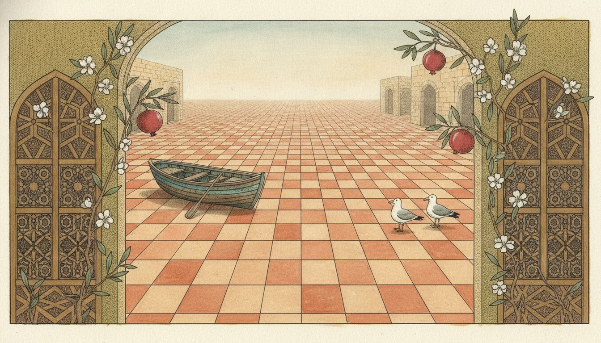
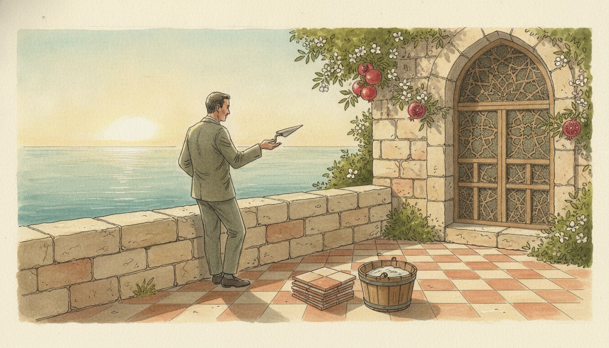
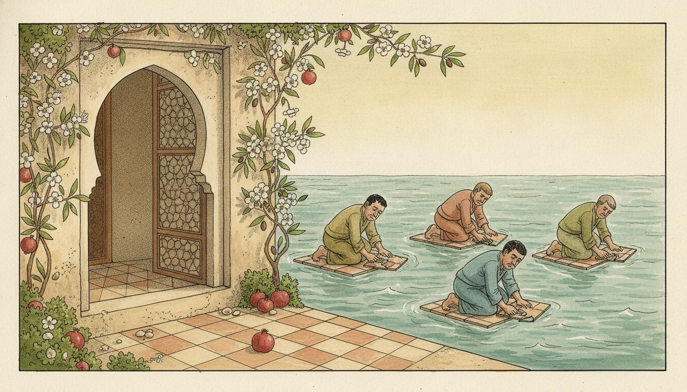

## خاطِرة

في تعبير شامي بحبّه كتير: «بلّط البحر».

حرفيًا، يعني تحطّ بلاط على البحر. وهاد إشي مستحيل. ما حدا بيقدر يبلّط البحر.

عشان هيك، لما حدا بيقلّك «روح بلّط البحر»، هو عم يقلّك: اعمل شو ما بدّك، ما رح يتغيّر إشي. أنا مش فارقة معي.



بس انتبه: هاد تعبير مش مؤدّب كتير. مع صحابك بيمشي، وبتضحكوا. بس مع مديرك؟ لا.

### أمثلة

{}



{}



## كلام

| Arabic | IPA | Meaning |
| ------ | --- | ------- |
| بلّط | /ˈballitˤ/ | tile! pave! (imperative; بلاط = floor tiles) |
| مش عاجبك | /miʃ ˈʕaʒbak/ | you don't like it (lit. «it doesn't please you»; feminine مش عاجبك /ʕaʒbik/) |
| شو ما بدّك | /ʃu ma ˈbiddak/ | whatever you want |
| مش فارقة معي | /miʃ ˈfaːrʔa ˈmaʕi/ | it makes no difference to me; I don't care |

---

*I post something short here most days while learning Arabic. If this helped, you'll probably like the next one too.*

