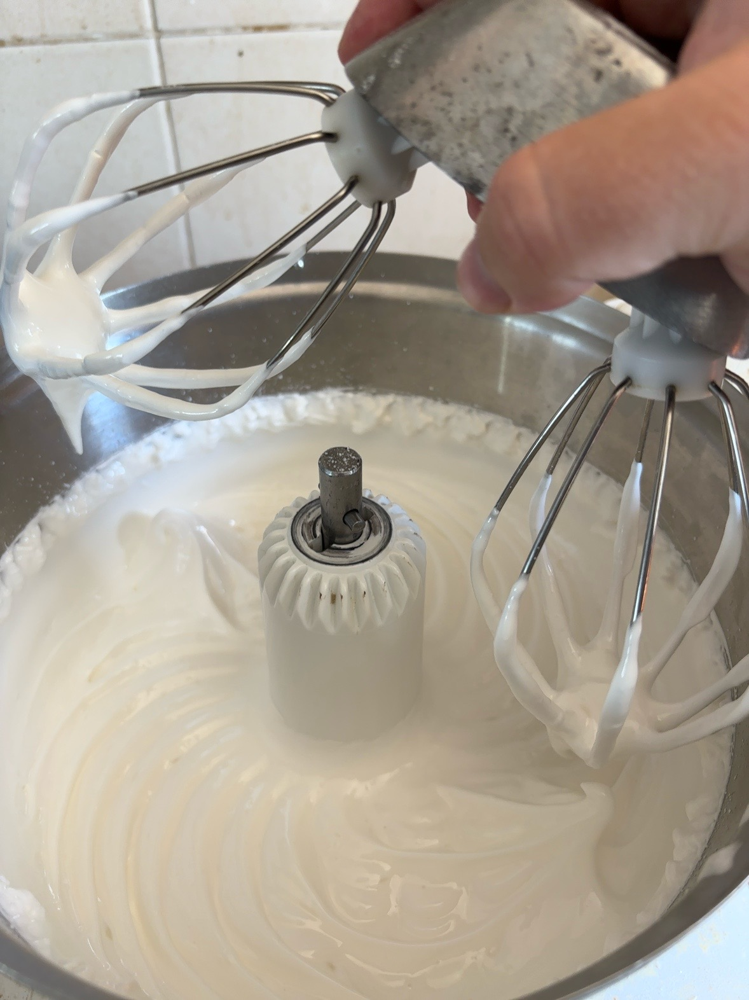
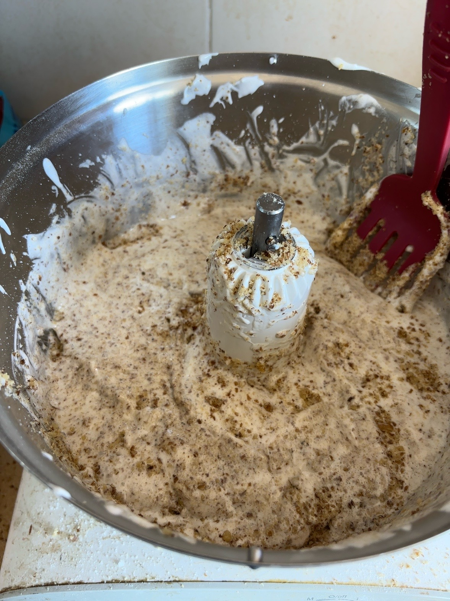
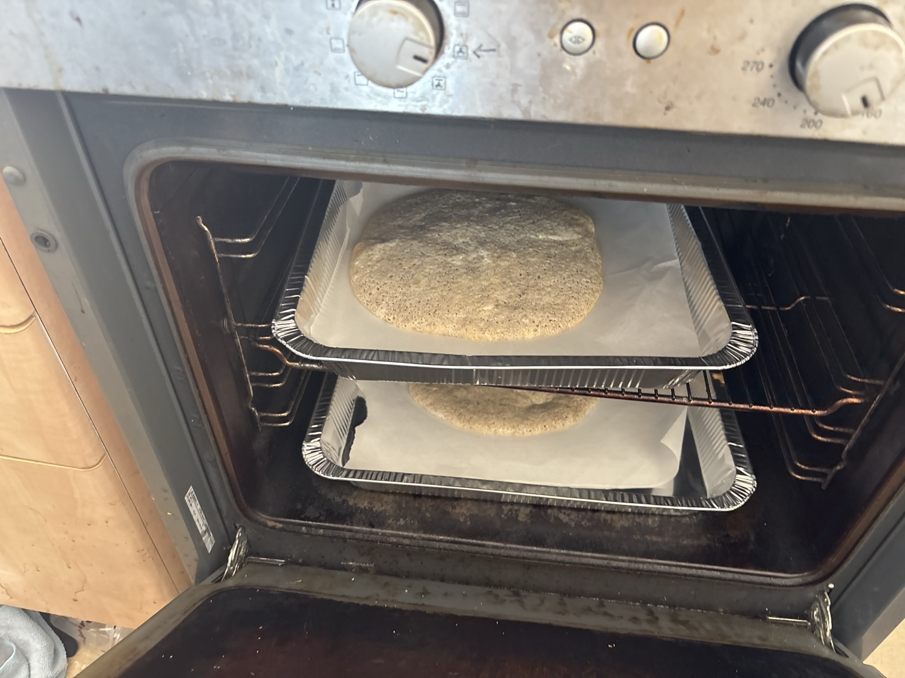
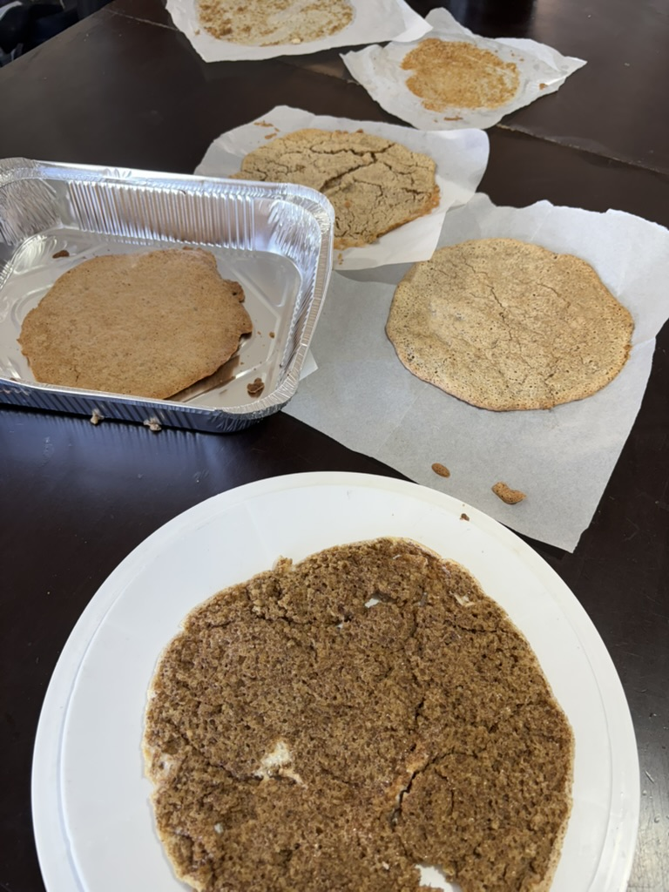
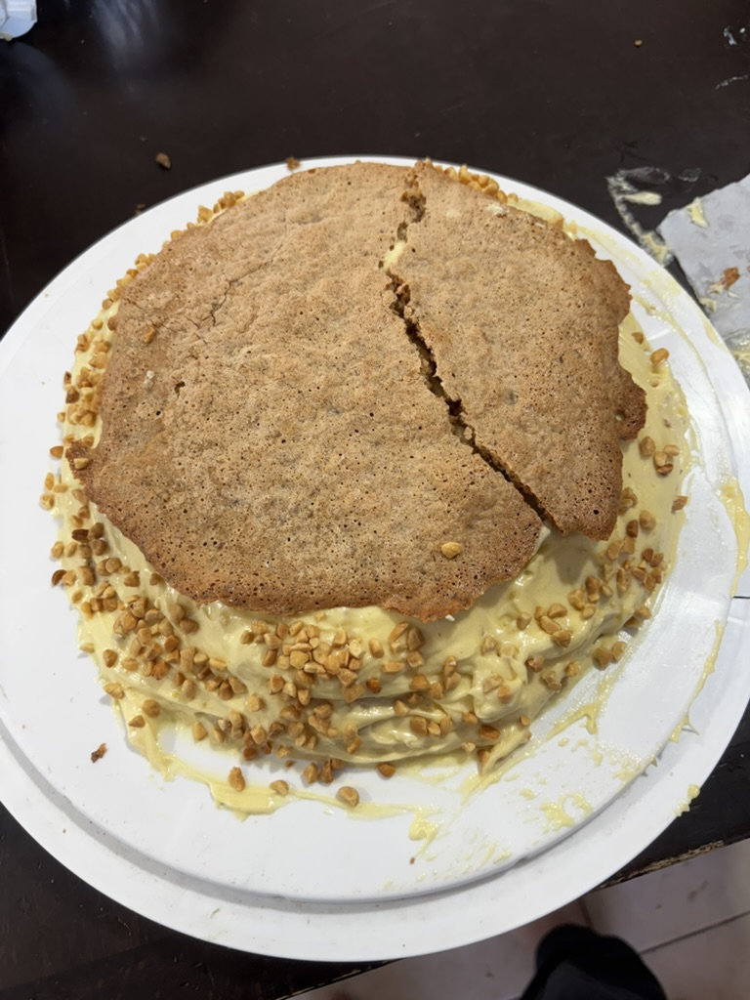
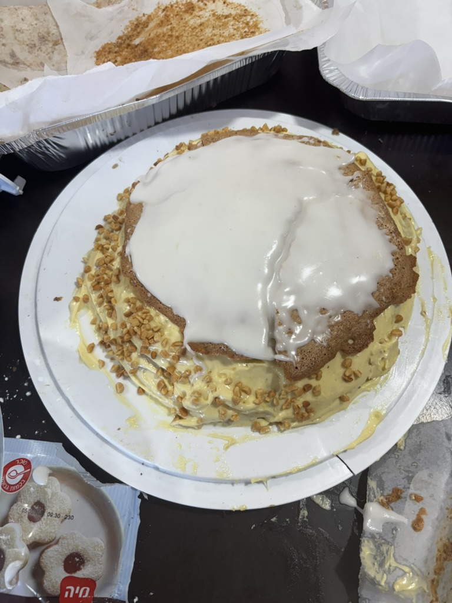
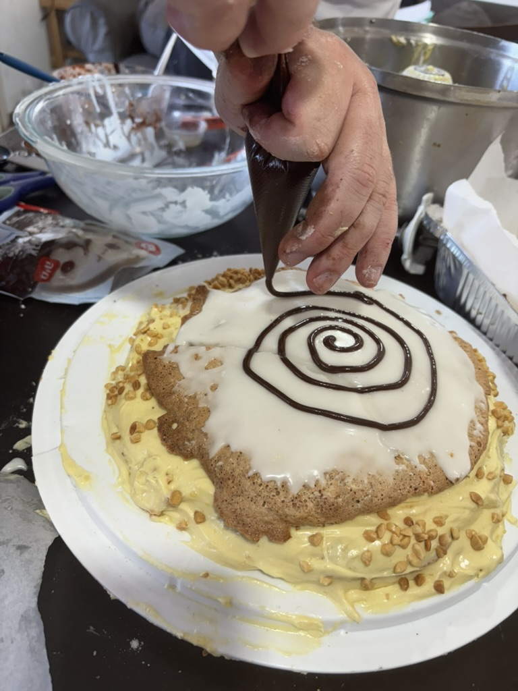
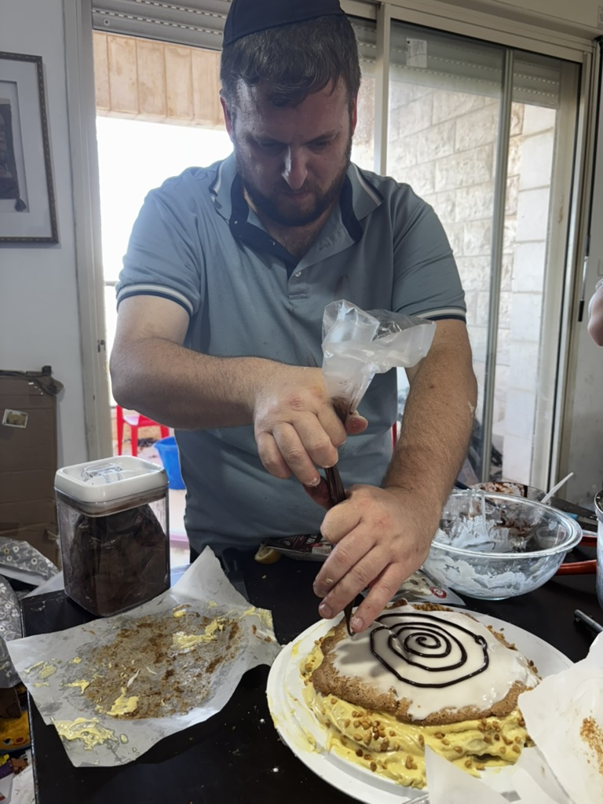
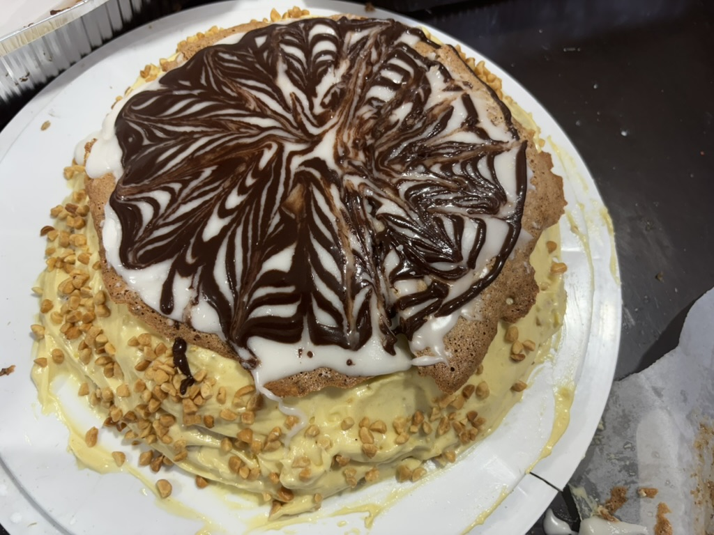
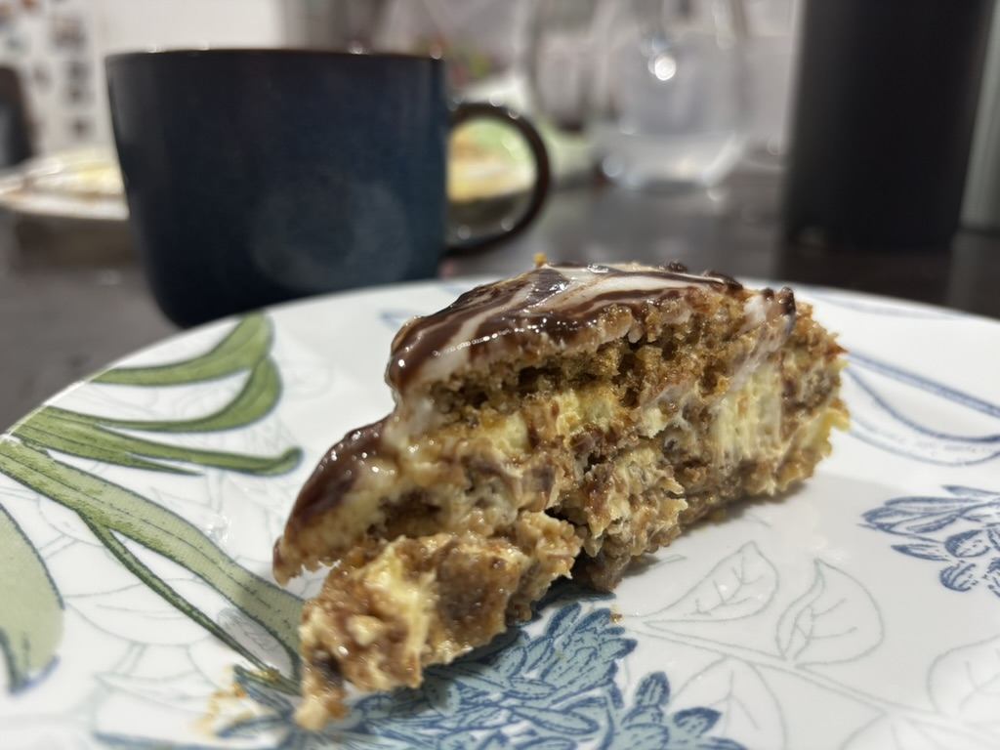



إمبارح كان عيد ميلادي حسب التقويم اليهودي. الجمعة اللي فاتت عملت كيك جديد اسمه إسترهازي، وهو نوع كيك هنغاري. كان طيّب كتير، بس أخد شغل كتير لحتى أعمله.

عملته هيك، وبعدين بحكي عن شو رح أغيّر بالمرة الجاي.

## المكوّنات

1. ١٠ بيضات
2. ١ كوب سكّر
3. ٢ كوب سكّر بودرة
4. ٢٠٠ غرام جوز مطحون
5. ١ كوب حليب
6. ١ ملعقة كبيرة فانيلا
7. ٣ ملاعق كبيرة طحين
8. ٢–٣ ملاعق كبيرة عصير ليمون
9. ١ ملعقة كبيرة كاكاو
10. ١١٣ غرام زبدة بحرارة الغرفة

## طريقة التحضير

### الميرانغ

- حمّوا الفرن على ١٦٠ درجة.
- أوّل شي، افصلوا صفار البيض عن بياض البيض. رح نستعمل البياض للميرانغ، والصفار لحشوة الكاسترد.
- اخفقوا بياض البيض بالخلاط. ضيفوا السكّر شوي شوي. كمّلوا الخفق لحدّ ما يصير الميرانغ ماسك حاله.
- بهدوء وبشويش، قلّبوا الجوز المطحون مع بياض البيض.
- ارسموا دواير قُطرها ١٨ سم على الجهة الخشنة من ورق الخَبز. بعدين اقلبوا ورق الخَبز، وافردوا خليط بياض البيض جوّا الدواير. اخبزوها بالفرن لحدّ ما يصير لونها ذهبي. خلّوها تبرُد تمامًا قبل ما تمسكوها.

صور من تحضير طبقات الميرانغ:


  
  
  
  


### الكاسترد

- اخفقوا صفار البيض بالخلاط، وضيفوا ١٠٠ غرام سكّر بودرة شوي شوي.
- سخّنوا الحليب مع الفانيلا، وبعدين صبّوه شوي شوي على خليط صفار البيض وهو عم ينخفق.
- صبّوا الخليط كلّه بطنجرة صغيرة، واطبخوه على النار مع الخفق المستمر لحدّ ما يغلي. بعدين كمّلوا طبخ وخفق لحدّ ما يوصل لقوام كاسترد سميك.
- حطّوا الكاسترد بوعاء واسع وخلوه يبرد. لمّا يضلّه دافي شوي، اخلطوا معه الزبدة.

### الفوندان

- ضيفوا ملعقة كبيرة عصير ليمون على ١٠٠ غرام سكّر بودرة، وبعدين كمّلوا تضيفوا شوي شوي — ملعقة كبيرة كل مرة — لحدّ ما يوصل لقوام فوندان سميك كتير. إذا زوّدتوا عصير الليمون، رح يصير سائل زيادة. عندي، حوالي ملعقتين كبار كانوا كفاية.
- خدوا حوالي ٣ ملاعق كبار من الفوندان على جنب، وضيفوا عليهم الكاكاو.

### تجميع الكيك

- التجميع بيكون على شكل طبقات. شيلوا طبقة ميرانغ عن ورق الخَبز بحذر، وحطّوا عليها كم ملعقة من حشوة الكاسترد. كرّروا نفس الشي مع كل طبقات الميرانغ، بس انتبهوا تقسّموا الكاسترد منيح عشان يضلّ معكم كفاية لتغطّوا الجوانب بعدين. ما تحطّوا كاسترد على طبقة الميرانغ اللي فوق. غطّوا الطبقة اللي فوق بالفوندان الأبيض.
- حطّوا فوندان الشوكولاتة بكيس تزيين، وارسموا حلزونة من الشوكولاتة من نصّ الكيكة لبرّا.
- بعود أسنان، اسحبوا خطوط: مرّة من نصّ الكيكة لبرّا، ومرّة من برّا لنصّ الكيكة. كرّروا هيك لحتى يطلع شكل حلو على وجه الكيكة.
- غطّوا جوانب الكيكة بالكاسترد. إحنا زيّنا الجوانب بفستق سوداني محمّص ومقطّع، مع إنه الوصفة الأصلية كانت طالبة شرائح لوز مرتّبة على الجوانب. بس بصراحة، بهديك المرحلة كنت فقدت صبري.  😅

ومن التجميع والتزيين، لحدّ الشريحة الأخيرة:


  
  
  
  
  
  


## أشياء رح أغيّرها بالمرة الجاي

1. الجوز كان مرّ شوي على ذوقي. بالمرة الجاي رح أستعمل طحين لوز.
2. فوندان الليمون طلع قوي شوي. يمكن بالمرة الجاي أجرّب فوندان بنكهة البندق.
3. بالمرة الجاي، ناوي أزيّن الجوانب بجوز هند محمّص بدل الفستق السوداني.

ضلّوا متابعين لعيد ميلادي المدني بـ٥ تمّوز، لمّا أجرّب الوصفة مع التغييرات اللي حكيت عنها.


## كلام

بما إنه هاد بوست وصفة، جمّعت كل كلمات الطبخ والخَبز بمكان واحد.

### المكوّنات

| Arabic | IPA | Meaning |
| --- | --- | --- |
| بيض  | /beːdˤ/ | eggs |
| صفار البيض  | /sˤˈfaːr el beːdˤ/ | egg yolks |
| بياض البيض  | /bˈjaːdˤ el beːdˤ/ | egg whites |
| سكّر بودرة  | /ˈsokkar ˈbuːdra/ | powdered (icing) sugar |
| طحين  | /tˤˈħiːn/ | flour |
| طحين لوز  | /tˤˈħiːn loːz/ | almond flour |
| جوز مطحون  | /ʒoːz matˤˈħuːn/ | ground walnuts |
| حليب  | /ħaˈliːb/ | milk |
| زبدة  | /ˈzebde/ | butter |
| كاكاو  | /kaˈkaːw/ | cocoa |
| عصير ليمون  | /ʕaˈsˤiːr lajˈmuːn/ | lemon juice |
| جوز هند  | /ʒoːz hend/ | coconut |
| فستق سوداني  | /ˈfostoʔ suˈdaːni/ | peanuts |

### الأفعال

| Arabic | IPA | Meaning |
| --- | --- | --- |
| حمّى الفرن  | /ˈħamma el ˈforon/ | to preheat the oven |
| فصل  | /ˈfasˤal/ | to separate (yolks from whites) |
| خفق  | /ˈxafaʔ/ | to whip / beat |
| ضاف  | /dˤaːf/ | to add |
| قلّب  | /ˈʔallab/ | to fold / stir |
| فرد  | /ˈfarad/ | to spread out |
| خبز  | /ˈxabaz/ | to bake |
| سخّن  | /ˈsaxxan/ | to heat up |
| صبّ  | /sˤabb/ | to pour |
| طبخ  | /ˈtˤabax/ | to cook |
| غلى  | /ˈɣila/ | to boil |
| برّد  | /ˈbarrad/ | to cool (something) down |
| غطّى  | /ˈɣatˤtˤa/ | to cover |
| زيّن  | /ˈzajjan/ | to decorate |

### الأدوات والمصطلحات

| Arabic | IPA | Meaning |
| --- | --- | --- |
| الفرن  | /el ˈforon/ | the oven |
| الخلاط  | /el xalˈlaːtˤ/ | the mixer |
| طنجرة  | /ˈtˤanʒara/ | pot / saucepan |
| ورق خبز  | /ˈwaraʔ ˈxabez/ | baking parchment |
| كيس تزيين  | /kiːs tazˈjiːn/ | piping bag |
| عود أسنان  | /ʕuːd asˈnaːn/ | toothpick |
| طبقات  | /tˤabaˈʔaːt/ | layers |
| حشوة  | /ˈħaʃwe/ | filling |
| قوام  | /ʔaˈwaːm/ | consistency / texture (see the card above) |
| بحرارة الغرفة  | /bħaˈraːret el ˈɣorfe/ | at room temperature |
| لونها ذهبي  | /ˈloːnha ˈdahabi/ | golden (lit. «its color is golden») |

### تعابير

| Arabic | IPA | Meaning |
| --- | --- | --- |
| ماسك حاله  | /ˈmaːsek ˈħaːlo/ | set firm — here, the meringue once it's stiff (lit. «holding itself») |
| على ذوقي  | /ʕala ˈzoːʔi/ | to my taste / for my liking |
| أخد شغل كتير  | /ʔaxad ˈʃoɣol kˈtiːr/ | it took a lot of work (أخد = «took») |
| فقدت صبري  | /feˈʔedt ˈsˤabri/ | I lost my patience |
| ضلّوا متابعين  | /ˈdˤallu mtaːbʕiːn/ | stay tuned / keep following (a sign-off) |

---

*I post something short here most days while learning Arabic. If this helped, you’ll probably like the next one too.*
