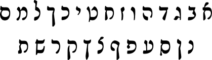
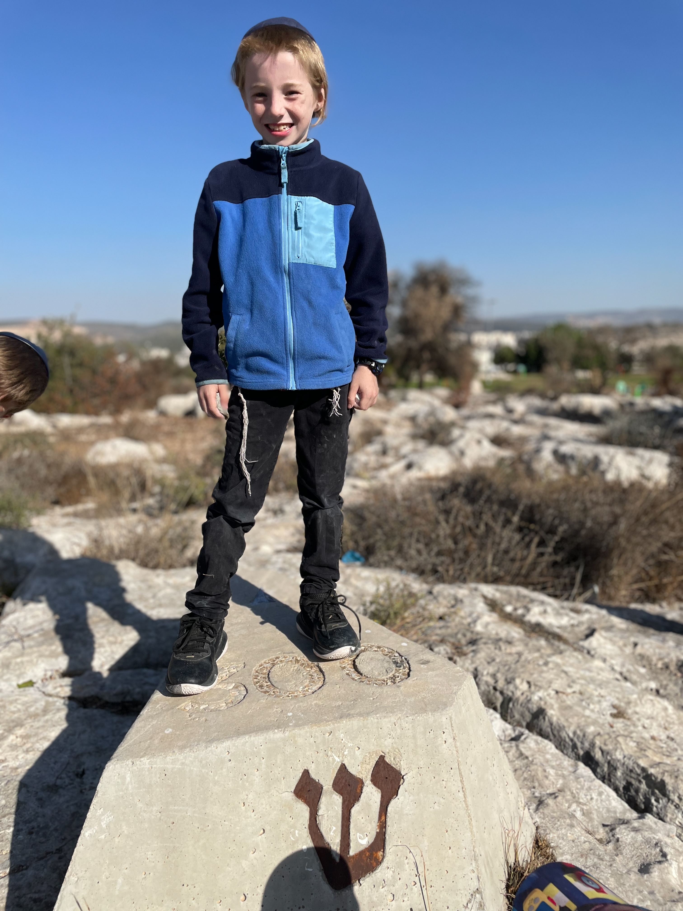
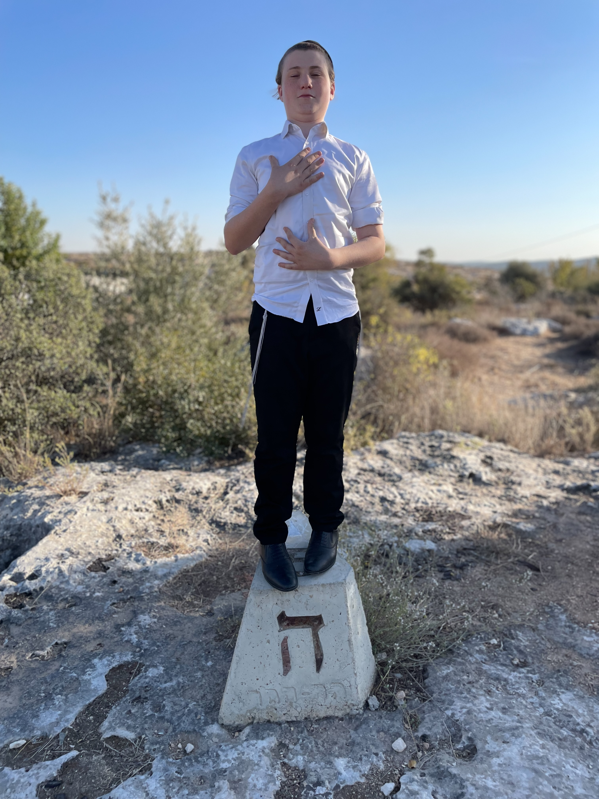
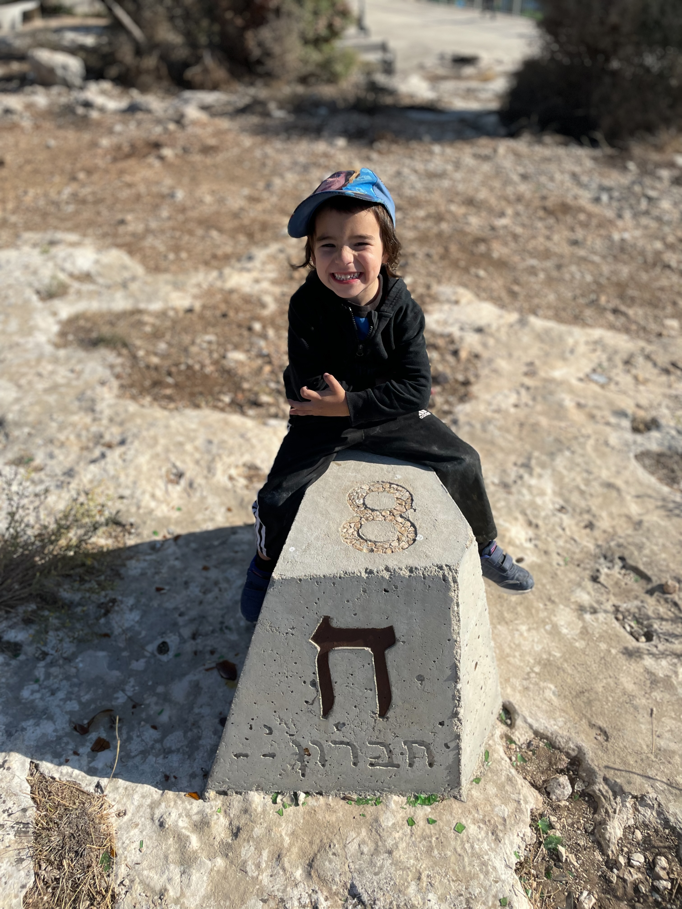
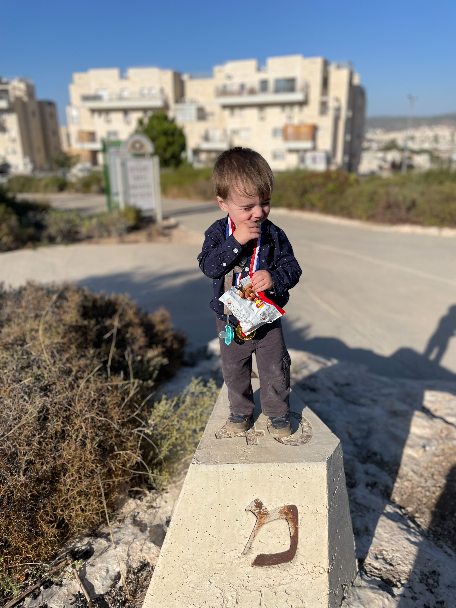
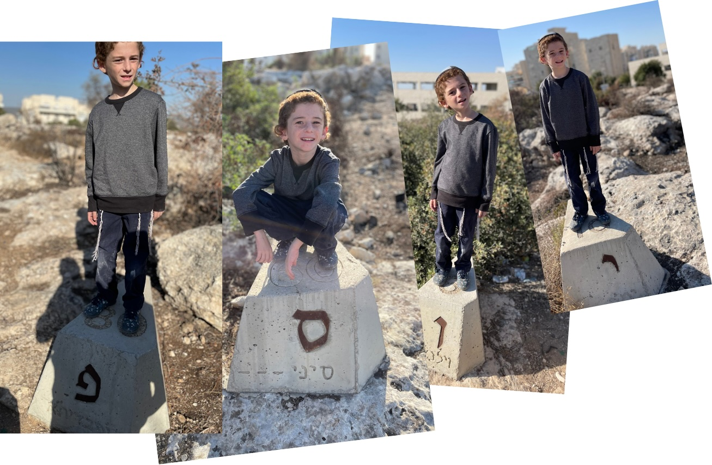

## جنّينة الحروف

ما كتبتش بوست ديلي دارجة لوقت طويل.  
الشهر هذا ما كانش عندي برشة وقت نعمل فيه اللي نحب.  
فما أخبار باهية، وتوّا كلّ الرهائن اللي كانوا عايشين رجعولنا من غزّة، الحمد لله!  
إن شاء الله الحرب هاذي توقّف بحق، وتكون النهاية فيها أمان لإسرائيل، وزادا حلّ خير للناس في غزّة من إنّهم يعيشو تحت حماس.  
ما نحكيش سياسة، أما هذا إلي نتمنّاه بصراحة.

في مدينة بيت شمش فما جنّينة اسمها **"جنّينة الحروف"** — هيّا جنّينة مزينة وتعليميّة للصغار.  
في اللغة العبرية فما أكثر من طريقة وحدة باش تكتب الحروف العبرية.  
قبل ما نحكيو على شنّو المزيان في **"جنّينة الحروف"**، لازم نفهمو شويّة على الحروف العبرية والتاريخ متاعها.

---

### أنواع الخطوط في العبرية

في العبرية فما برشة أنواع متاع كتابة، وكلّ نوع جا في وقت، وعندو استعمال خاصّ.

#### كتب عبري عتيق 
##### (حوالي 1000–500 قبل الميلاد)
هذا أقدم خطّ، يشبه الخطّ الفينيقي. كانو يكتبو بيه في النقوش القديمة قبل المنفى في بابل.



#### كتب أشوري
#####  (من بعد 500 قبل الميلاد تقريبًا)
بعد المنفى، اليهود تبنّاو خطّ جديد من الآرامية، يسمّيوه **"أشوري"**.  
هو الخطّ اللي نلقاو بيه التوراة اليوم.



#### كتب مربّع 
##### (من القرن الثالث قبل الميلاد و ما بعد)
مع الوقت، الخطّ الأشوري ولى مربّع أكثر، وهو اللي نطبعو بيه الكتوب الحديثة والعبرية اليومية.  
يعني، الكتبة اللي تشوفها في أي كتاب عبري، هذا يسمّيوه **"كتب مربّع"**.



#### كتب راشي  
##### (من القرن الخامس عشر ميلادي)
في التفاسير القديمة، الحروف يجيّو بطريقة أخرى يسمّيوها **"خطّ راشي"**.  
راشي هو مفسّر مشهور، والمطابع طبعو تفسيرو بالحروف ذيك، والاسم بقى.

#### خطّ اليد / خطّ مدوّر 
##### (من العصور الوسطى و من بعد)
وقت الناس تكتب باليد، ما تستعملش الخطّ المربّع، تستعمل خطّ يدوي يسمّيوه **"خطّ مدوّر"**.  
هذا اللي نلقاو بيه الملاحظات، الرسائل، والكتابة اليومية.


---

يعني، من القديم للعصر الحديث:  
**عبري عتيق ← أشوري ← مربّع ← راشي ← مدوّر.**  
كلّ واحد عندو تاريخه وغرضه.

---

### الطريق في جنّينة الحروف

في الطّريق متاع **"جنّينة الحروف"**، كلّ مكعّب عندو حرف عبري مكتوب بثلاثة طرق:  
الخطّ العصري اللي نكتبو بيه توّا، و الخطّ العبري العتيق، و زادا الخطّ راشي.  
فوق الحروف فما رقم صغير يورّي القيمة متاع الحرف في الجِمَطْرِيّا، يعني الحساب بالأحرف.  

اللّعب هو تمشّي في الطّريق و تلقى الحروف واحد بواحد، و كلّ مرّة تتعلّم شكل جديد و معنى جديد.



الجِمَطْرِيّا هي طريقة قديمة يستعملوها اليهود باش يبدّلو الحروف لأرقام.  
كلّ حرف عندو رقم خاصّ بيه، و كي تجمع الحروف تخرّج رقم جديد.  
برشة ناس يستعملوها باش يفسّرو المعاني المخفيّة في الكلمات، أما زادا تنجّم تكون كيف لعبة ذكيّة بين اللغة و الحساب.


---

**توا نرجعو لجنّينة الحروف** — باش نحكيو شنّوّة الفكرة منها، وعلاش الحروف نفسهم جزء من اللعب والتعليم فيها.

العام اللي فات، في عيد سوكوت، جيت بولادي لجنّينة هذي وخذيت تصاور لكلّ واحد فيهم مع الحروف في اسمهم.  
عملنا بيهم زينة السُكّة متاعنا العام هذا.  
ولادي كانوا فرحانين برشة كي شافو التصاور متاع العام اللي فات، و شافو أساميهم مكتوبة بالتصاور متاع الحروف!


  
  
  
  
  
  
