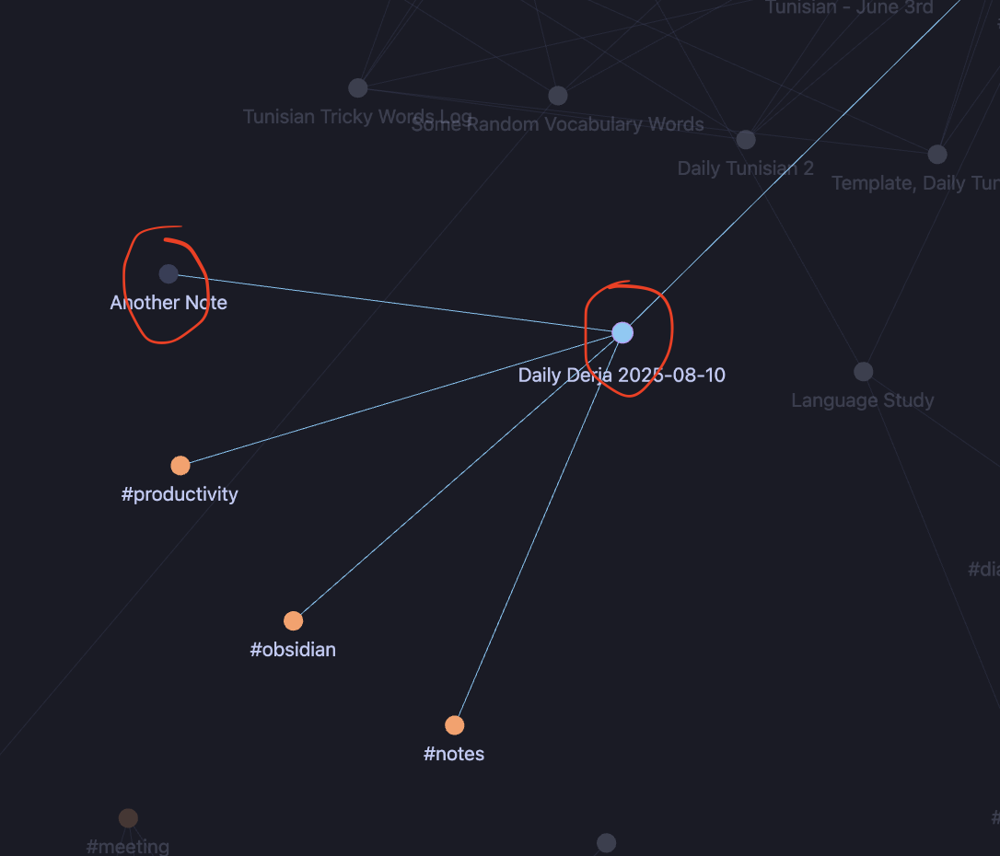
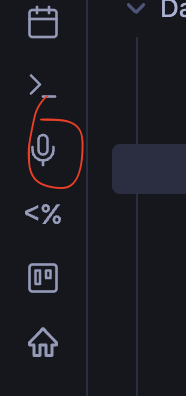
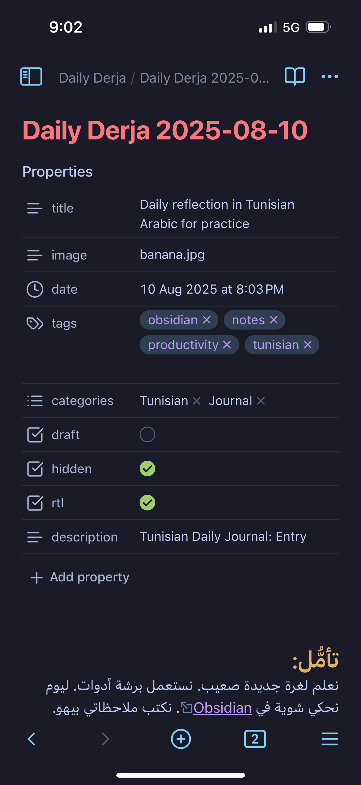

## تأمُّل:
نعلم لغرة جديدة صعيب. نستعمل برشة أدوات. ليوم باس نحكي شوية في [Obsidian](https://obsidian.md/). نكتب ملاحظاتي بيهو. Obsidian هوا edituer Markdown فيه ردط ساهل و إيكوسيستام قوي متاع plugins و templates. مثلأ فمة plugin يسمهو QuickAdd. عندي template لالديلي دارجة و كي نحب نكيب post نعمل QuickAdd ويعمل frontmatter و هكا.


The template:
```markdown
---
title: Daily reflection in Tunisian Arabic for practice
image: banana.jpg
date: "{{DATE:YYYY-MM-DDTHH:mm:ss}}"
tags:
categories:
draft: false 
hidden: true
postLang: ar
dialect: ["tunisian"]
---

## تأمُّل:

## كلام «جديد»:

## ڤيديو:

```

كي ناخو ملاحظة مرتبطة بملاحظة أخرى نخم نعمل link هكا.


```markdown
This note is related to [[Another Note]]!
```



و نلقدها في graph view



الدّويرة رمادي خاطر ما قماش مرتبطة هاذي.أما كان نكليكّي دوبل على الدويرة، تتعمل.

و زادة ساهيل برشة نسجّل صوت.


و نجم نستعمل في Obsidian في تلفوني زادة:



