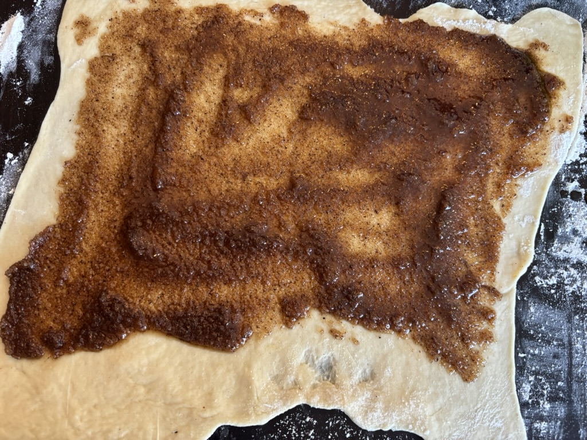
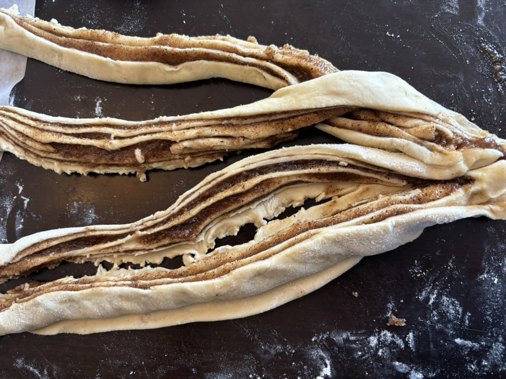

اليوم هو الجمعة و يلزمني نحضّر الدار لشبات القدس. عملت "بابكا" לכבוד שבת (اشرف الشبات)، هي حلويات يهودية يعملوها للسبت من عجينة بقايا من صنع الخبز "خالا".

كيفاش نعملوها؟ هكّة!

#### الخطوة اللّولة
حضّر خليط القرفة، السكر الأسمر، السكر الفانيلي والزيت.
#### الخطوة الثنِية
حلّ العجينة رقيقة برشة.


#### الخطوة التالْثة 
فرّق خليط القرفة والسكر على العجينة.

#### الخطوة الرابعة
لفّ العجينة على شكل سيلندر طويل.


#### الخطوة الخامسة
أول قصّ العجينة الملفوفة من الوسط بالطول، وبعد قصّ السيلندر على الوسط بالعرض باش يخرجو أربعة قطع: زوج سيلندر مقصوصين بالطول.

#### الخطوة السادسة
عمل ضفرة بيهم و ادهن بالبيض.


#### الخطوة السابعة
حطه في الكوشة.

## كام «جديد»:
1. عجينه
2. خليط
3. القرفة
4. فرّق
5. ضفرة
## ڤيديو:
