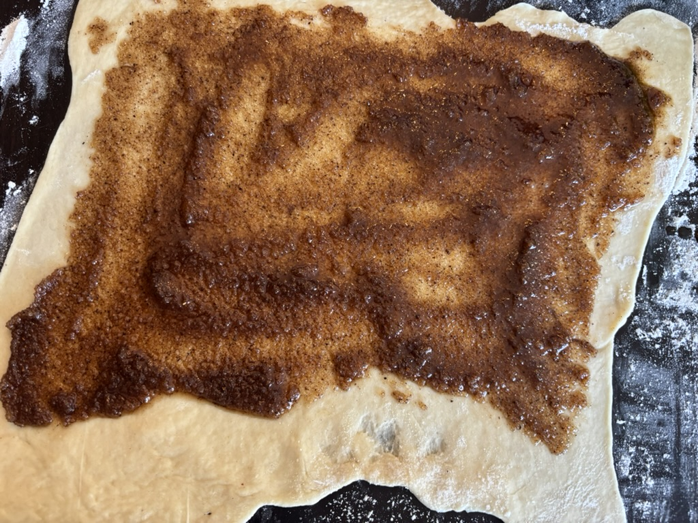
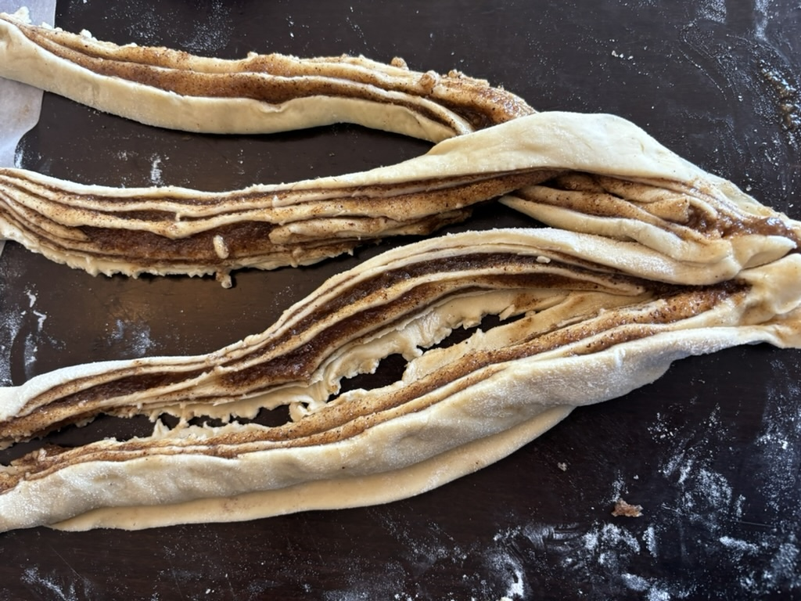

اليوم هو الجمعة و يلزمني نحضّر الدار لشبات القدس. عملت "بابكا" לכבוד שבת (اشرف الشبات)، هي حلويات يهودية يعملوها للسبت من عجينة بقايا من صنع الخبز "خالا".

كيفاش نعملوها؟ هكّة!

#### الخطوة اللّولة

حضّر خليط القرفة، السكر الأسمر، السكر الفانيلي والزيت.

#### الخطوة الثنِية

حلّ العجينة رقيقة برشة.


#### الخطوة التالْثة

فرّق خليط القرفة والسكر على العجينة.

#### الخطوة الرابعة

لفّ العجينة على شكل سيلندر طويل.


#### الخطوة الخامسة

أول قصّ العجينة الملفوفة من الوسط بالطول، وبعد قصّ السيلندر على الوسط بالعرض باش يخرجو أربعة قطع: زوج سيلندر مقصوصين بالطول.

#### الخطوة السادسة

عمل ضفرة بيهم و ادهن بلالعظم.


#### الخطوة السابعة

حطه في الكوشة.

---





## كلام «جديد»:

1. عجينه - בצק - /ʕˈʒiː.næ/ 
2. خليط - תערובת -  /xˤlæˈjˤtˤ/ 
3. القرفة - קינמון - /lˈqɪrfæ/ 
4. فرّق - למרוח -  /ˈfærːəq/ 
5. ضفرة - קליעה - /ˈðˤfɾæ/ 
