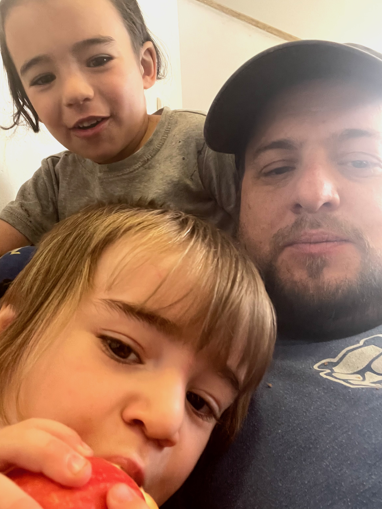
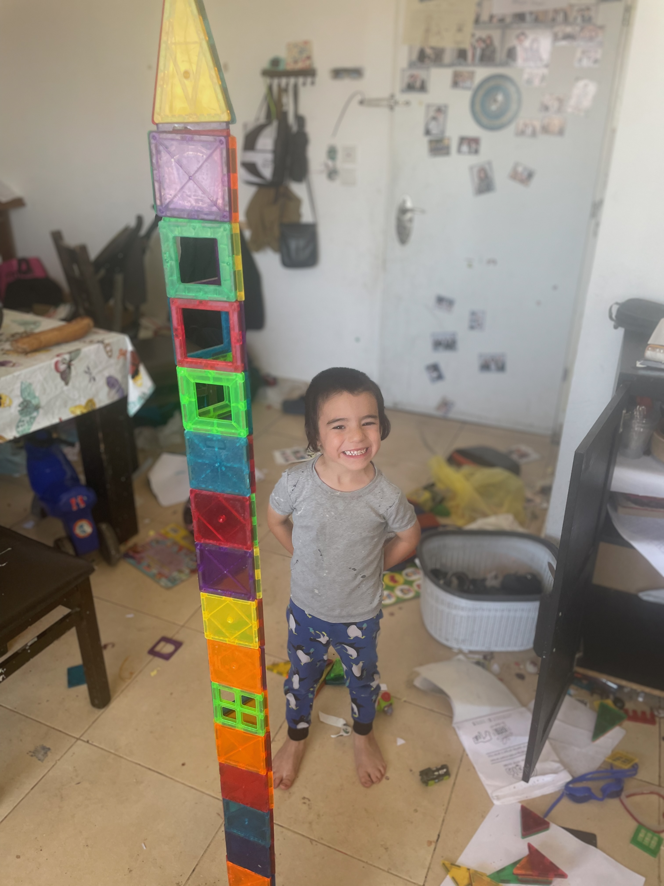

نهار جمعة ما نخدمش. الصباح لعبت مع الصغار. الليل لي فات كان هاني، الحمدلله. توا يلعبو مع مَغْنَاطِيسات. الدار مكركبة بارشة خلى المكان مسكّر و النهار الكل الصغار في الدار.

مرتي خرجت للحانوت و  موشي يخاف برشة - ديمه يسألني "وقتاش باش تروّح ماما؟" و "تظنّ فمّة صفّارة?". أنا حزين من هاذا.

غدوة مش باش نكتب خطر نهار السبت.


  
  


<!--  -->
