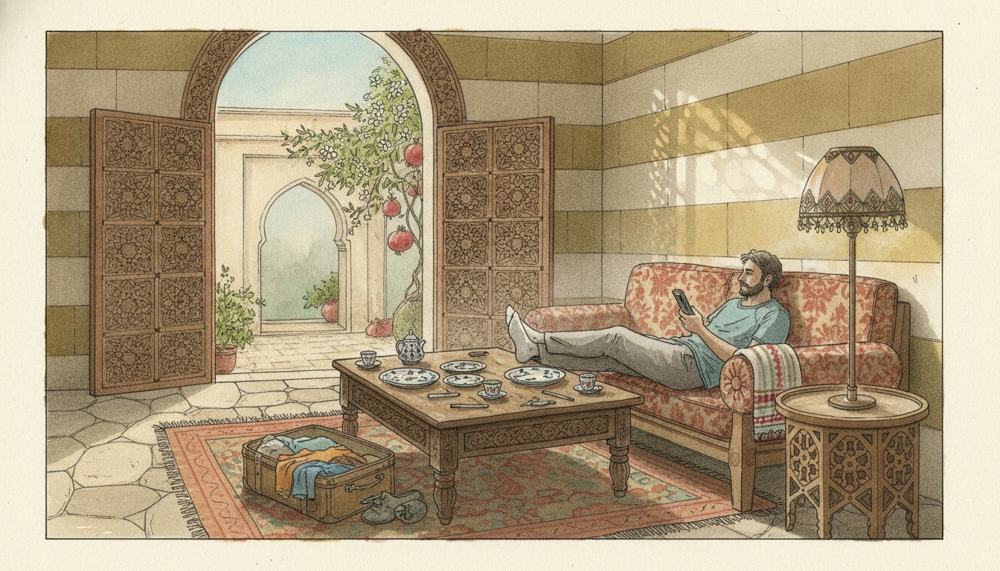

<!-- raw-transcript
أنا من الناس اللي بيحتاجوا مكان خاص إلهم، يقعدوا فيه لحالهم ويشتغلوا ويفكروا. هالشي ضروري بالنسبة إلي.

بسكن بشقة، وعندي غرفة بستعملها عادة كمكتب، بس لما يكون عندنا ضيف، بتصير غرفة ضيوف.

أبو مرتي إجا يزورنا وقعد عندنا خلال الأعياد، وكان المفروض يرجع لأمريكا مبارح بالليل.

بس بطريق الرجعة، كان عنده ترانزيت بدبي. وخلال الأعياد صار حادث إرهابي بإسرائيل إله علاقة بشركة فلاي دبي، وانلغت رحلته.

بعتوا له إيميل قبل موعد الرحلة بوقت طويل، بس هو ما قرأ الإيميل، وما كان عارف إنو الرحلة انلغت لما مرتي وصلته عالمطار.

لو كنا عارفين، كان قدرنا نتعامل مع الموضوع بالوقت المناسب، وما كانت صارت مشاكل. بس هلأ لازم يضل هون لأسبوع تاني.

مش مبسوط من هالشغلة.

وكمان الأسبوع الجاي رح تيجي أختي مع جوزها وبنتها. حاسس حالي فاتح فندق رخيص!

الضيف أول ليلة شريف، وثاني ليلة لطيف، وثالث ليلة… بصير تقيل شوي!

بس بصراحة أنا مبسوط إنهم كلهم بيزورونا وبيقعدوا عندنا. بس أحياناً بدي أفضفض شوي.
-->

## خاطِرة

أنا من الناس اللي بيحتاجوا مكان خاص إلهم، يقعدوا فيه لحالهم ويشتغلوا ويفكروا. هالشي ضروري بالنسبة إلي.

بسكن بشقة، وعندي غرفة بستعملها عادة كمكتب، بس لما يكون عندنا ضيف، بتصير غرفة ضيوف.

أبو مرتي إجا يزورنا وقعد عندنا خلال الأعياد، وكان المفروض يرجع لأمريكا مبارح بالليل.

بس بطريق الرجعة، كان عنده ترانزيت بدبي. وخلال الأعياد صار حادث إرهابي بإسرائيل إله علاقة بشركة فلاي دبي، وانلغت رحلته.

بعتوا له إيميل قبل موعد الرحلة بوقت طويل، بس هو ما قرأ الإيميل، وما كان عارف إنو الرحلة انلغت لما مرتي وصلته عالمطار.

لو كنا عارفين، كان قدرنا نتعامل مع الموضوع بالوقت المناسب، وما كانت صارت مشاكل. بس هلأ لازم يضل هون لأسبوع تاني.

مش مبسوط من هالشغلة.

وكمان الأسبوع الجاي رح تيجي أختي مع جوزها وبنتها. حاسس حالي فاتح فندق رخيص!

الضيف أول ليلة شريف، وتاني ليلة لطيف، وتالت ليلة… بصير تقيل شوي!

بس بصراحة أنا مبسوط إنهم كلهم بيزورونا وبيقعدوا عندنا. بس أحياناً بدي أفضفض شوي.

{{< expression
  ar="الضيف أول ليلة شريف، وثاني ليلة لطيف،|وثالث ليلة قريف."
  kind="proverb"
  ipa="idˤˈdˤeːf ˈʔawwal ˈleːle ʃaˈriːf w ˈtaːni ˈleːle laˈtˤiːf w ˈtaːlit ˈleːle ʔaˈriːf"
  literal="The guest is honourable the first night, pleasant the second night, and disgusting the third night."
  meaning="Guests are a joy, but even a welcome guest wears out the welcome after a few days. قريف comes from قرف (disgust): «a real pain»."
  use="Said with a smile when a visit runs long, or by a guest as a polite reason to leave. Light teasing, not an insult, but don't say it straight to a guest's face."
  audio="/audio/il-dayf-awwal-layle.mp3"
>}}



## كلام

| Arabic | IPA | Meaning |
| ------ | --- | ------- |
| لحالهم | /laˈħaːlhom/ | on their own; by themselves (لحالي = by myself) |
| كان المفروض | /kaːn ilmafˈruːdˤ/ | was supposed to; was expected to |
| انلغت رحلته | /inˈlaɣat ˈriħilto/ | his flight was cancelled |
| لازم يضل هون | /ˈlaːzim jdˤall hoːn/ | he has to stay here (ضل = to stay or remain) |
| حاسس حالي | /ˈħaːsis ˈħaːli/ | I feel like; I feel as though (said by a man) |
| بدي أفضفض شوي | /ˈbiddi ʔaˈfadˤfidˤ ʃwajj/ | I want to vent a little; get something off my chest |

---

*I post something short here most days while learning Arabic. If this helped, you'll probably like the next one too.*

