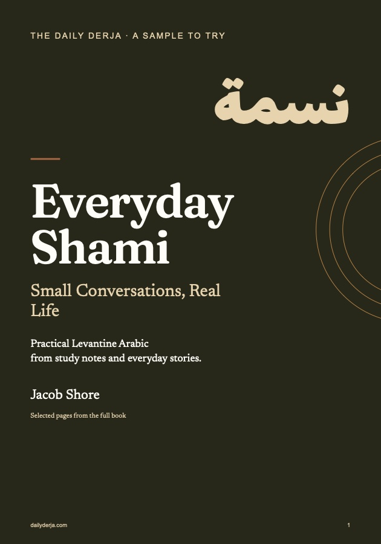

Thanks for confirming. Your free copy of **Everyday Shami: Small Conversations, Real Life** is ready.

<a href="/downloads/everyday-shami-sample.pdf" download class="dd-dl-btn" data-download="everyday-shami-sample">Download the ebook (PDF, 16 pages)</a>

## What's inside

- **A complete lesson:** eight phrases for keeping a conversation going when a word goes missing, with practice and answers.
- **How I study:** flashcards, Anki, and why you shouldn't guess the vowels.
- **A pronunciation key,** so you can start without reading Arabic script.
- **Texting in Arabizi,** with real messages you'd actually send.
- **A short reading** from the blog with a pronunciation companion and English.
- **A taste of the idioms reference:** «على راسي», «ولا يهمّك», «صحتين», «يسلموا إيديك».

## Where to start

Read pages 3–6 first (the method and the pronunciation key). Then learn the eight phrases on pages 7–8 and try the practice on page 9 before you check page 10.

## What happens next

You'll get an email when there's a new post: a short diary entry in everyday Shami, with the useful phrases broken down. If the download link above ever stops working, reply to any email and I'll send it to you.

[Start with the latest posts →](/dialects/shami/)
